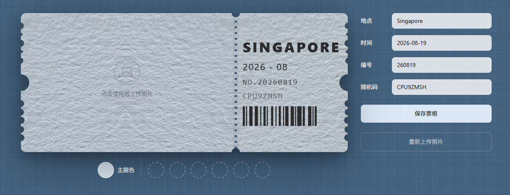
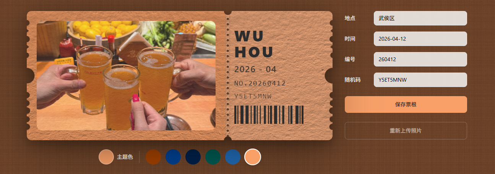

# 旅行票根生成器 / Travel Ticket

上传旅行照片，一键生成复古票根风格的纪念卡片。

> 🔗 在线体验：[https://ticket.chaochun.cc/](https://ticket.chaochun.cc/)

## 功能特性

- **照片上传**：支持拖拽或点击上传 JPG/PNG 照片。
- **EXIF 自动填充**：读取照片拍摄日期与 GPS 信息，自动填充票根日期、地点。
- **主题色提取**：从照片中智能提取主色调，作为票根配色方案。
- **纸质纹理**：内置水彩、棉卡、亚麻、珠光、羊皮等 5 种纸张纹理，默认使用水彩纸。
- **照片编辑**：支持拖拽移动、滚轮缩放、移动端双指捏合缩放，边缘自动吸附。
- **实时预览**：所见即所得，票根卡片悬停有 3D 倾斜与全息光泽效果。
- **一键导出**：导出高清 PNG/JPG 票根图片，独立于当前视口尺寸。
- **响应式布局**：桌面端与移动端均可正常使用。

## 界面预览

### 编辑前



### 编辑后



## 技术栈

- [Vue 3](https://vuejs.org/) + [TypeScript](https://www.typescriptlang.org/)
- [Vite 8](https://vite.dev/)
- [Tailwind CSS v4](https://tailwindcss.com/)
- [jsbarcode](https://github.com/lindell/JsBarcode) 生成条形码
- [exifr](https://github.com/MikeKovarik/exifr) 读取照片 EXIF
- [pinyin-pro](https://github.com/zh-lx/pinyin-pro) 中文城市拼音转换
- [made-by-footer](https://github.com/dulk-dev/made-by-footer) 页脚组件

## 本地开发

```sh
# 安装依赖
npm install

# 启动开发服务器
npm run dev

# 类型检查
npm run type-check

# 生产构建
npm run build

# 本地预览生产构建
npm run preview
```

## 部署

本项目是纯前端静态应用，构建产物位于 `dist/` 目录，可部署到任意静态托管服务（Cloudflare Pages、Vercel、GitHub Pages、Netlify 等）。

## 浏览器支持

建议使用 Chromium 内核浏览器（Chrome / Edge / Arc）或 Firefox，以获得最佳导出效果。

## 开源协议

[MIT](./LICENSE)
